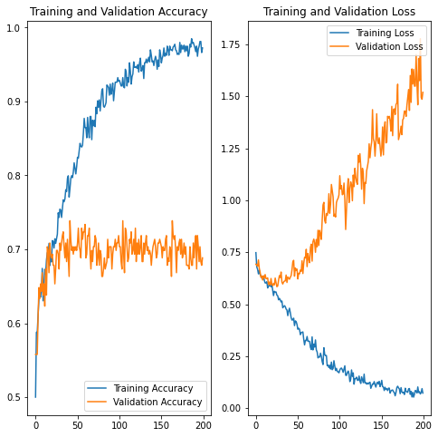
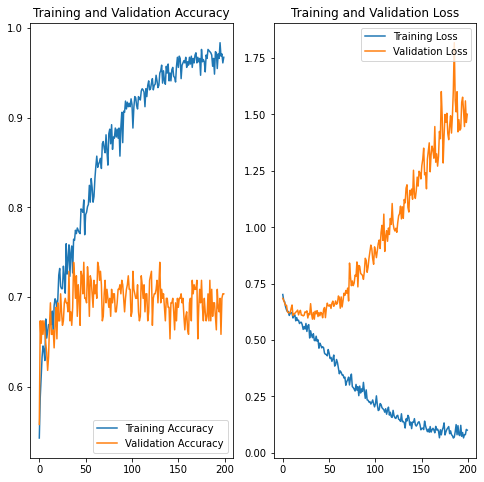

# 機器學習 期末作業

###### tags: `ML`, `YOLO`, `CNN`

資管三B 10814032 葉哲丞

---

# 研究目的

判斷出瓦斯爐的開關狀態，讓程式能進行下一階段的判斷。

# 使用資料集來源

與專題組員共同至IKEA，拍攝瓦斯爐各種狀態的照片。

    共有925張，經過專題組員手動標記，去除無法肉眼辨識的照片後，剩餘913張照片。

以及經過YOLO模型的判斷結果，將上方圖片裁切出只有瓦斯爐開關的照片。(
使用[crop_image.py](pre_CNN_images/crop_image.py))

    經YOLO模型裁切出1,054張，經過專題組員的標記後。
    其中標記為on的有580張，off的有417張，無法辨識的57張。

使用[Classification.ipynb](pre_CNN_images/Classification.ipynb)讓專題組員能夠輸入自己要負責的範圍，進行手動分類的動作，完成後會生成與學號同名的tar檔。要訓練時將全部組員的tar檔解包後，就會能夠作為訓練使用。

# 使用方法

使用的演算法：`YOLOv4`, `CNN`
會先使用YOLOv4尋找畫面中瓦斯爐開關的位置，找到以後依據輸出的Bounding Box，將瓦斯爐開關的這一塊圖片擷取下來，再交由CNN去分類成`on`或是`off`類別。

## YOLO

YOLO是一套監督式的影像物件偵測模型，執行環境為Darknet框架。能夠輸出被偵測物件的Bounding box及confidence。

## CNN

CNN(Convolutional Neural Networks，CNN) - 卷積神經網路是深度學習下的一個分支，常運用在影像辨識上，也是上述YOLO的基礎之一。藉由卷積層擷取影像每個特徵的機率，並判斷出該影像各種分類的機率。

# 實驗設計

## 實驗環境

使用[daisukekobayashi/darknet](https://hub.docker.com/r/daisukekobayashi/darknet)這個image的Docker環境作為本次報告的訓練、測試環境。

訊練過程中所使用的各項設定檔、訓練資料將會上傳至[這個Github](https://github.com/isJasonYeh/ML-final-assignment)。測試前從新的Docker環境clone Github的設定檔下來，確保每次測試環境是盡可能相同的。

## YOLO

嘗試改變的參數、變因有
* YOLOv4與YOLOv4-tiny的選擇
* batch數量
* 測試及資料的占比

各種batch的訓練時間的比較：
|             |   YOLOv4   | YOLOv4-tiny |
|-------------|:----------:|:-----------:|
| batch=4,000 |  685 mins  |  323 mins   |
| batch=6,000 | 1,008 mins |  487 mins   |

各種batch的AP比較：
|             | YOLOv4 | YOLOv4-tiny |
|-------------|:------:|:-----------:|
| batch=2,000 | AP=88% |   AP=72%    |
| batch=4,000 | AP=86% |   AP=75%    |
| batch=6,000 | AP=84% |   AP=78%    |

### YOLOv4與YOLOv4-tiny的選擇

由上方表格以及兩張圖，可以看出標準版YOLOv4的訓練時間與tiny有很大的差異，但AP也有很明顯的差異，**本次報告選用標準版YOLOv4**。

### batch數量

雖然在[AlexeyAB的Github](https://github.com/AlexeyAB/darknet)中，有說到batch=classes*2000,但不要少於6000。

但在本次分類數量為1的情況下，YOLOv4在batch=2,000後，AP沒有明顯成長，甚至出現稍微下降的情況，但是loss有隨著訓練繼續下降。為了節省訓練時間，**本此報告選擇batch=4,000**。

### 測試資料的占比

本次報告使用[makeList.py](yolov4/makeList.py)程式碼填寫train.txt和valid.txt，藉由調整`probability`變數的數值可以控制訓練集與測試(驗證)集資料的佔比。

在batch=4000下各種佔比的AP:
|             | AP  |
|-------------|-----|
| valid集佔10% | 88% |
| valid集佔20% | 86% |
| valid集佔30% | 89% |


三種情況的結果相差不大，valid集佔30%情況的AP稍微高於其他兩者，**本此報告選擇訓練集佔70%，驗證集佔30%**。

## CNN
參考[Image classification | TensorFlow Tutorials](
https://www.tensorflow.org/tutorials/images/classification)

### 架構

原始教材的架構是
```
資料增強 --> 正規化 --> 卷積層1 --> 池化層1 --> 卷積層2 --> 池化層2 --> 
卷積層3 --> 池化層3 -->  Dropout --> 扁平層 --> 全連接層
```
訓練情況為



可以觀察到有很嚴重的過擬和情形，因此嘗試在扁平層後方再加上一層Dropout

情況雖然有好轉，但過擬和情形還是很嚴重，就算提高數值也影響不大

# 實驗結果與討論

